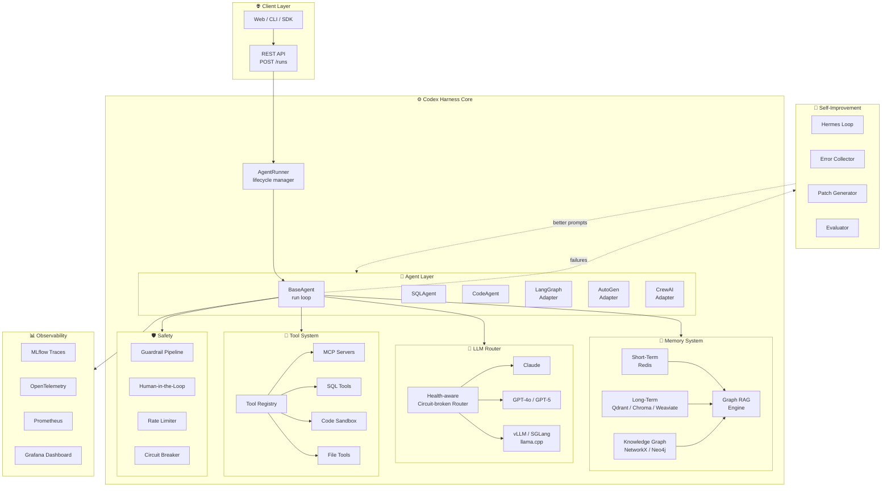

# 🧠 Codex Harness

> **Production-grade multi-agent AI harness — run any LLM, any framework, with memory, safety, and self-improvement built in.**

[](https://python.org)
[](https://fastapi.tiangolo.com)
[](LICENSE)
[](tests/)
[](docs/architecture/OVERVIEW.md)

---

## What Is Codex Harness?

Think of Codex Harness as the **engine room of an AI system**.

Just like a car has an engine, brakes, a fuel gauge, and a speedometer all working together — Codex Harness gives your AI agents: a **brain** (the LLM), **memory**, **tools**, **safety guardrails**, and a **self-improvement system**. You tell it what you want done; it figures out which AI model to use, remembers what it has learned before, runs the right tools safely, and gets smarter after every mistake.

| What you see | What Codex Harness does behind the scenes |
|---|---|
| AI answers your question | Routes to best available LLM, checks budget, falls back if provider fails |
| AI uses a tool (e.g. runs SQL) | Validates inputs, checks safety, executes in sandbox, logs result |
| AI "remembers" past context | Stores in Redis (short-term) and Qdrant vector DB (long-term) |
| AI finds relevant info quickly | Graph RAG traverses knowledge graph — 83% fewer tokens than naive search |
| AI gets smarter over time | Hermes loop: analyzes failures → proposes prompt patch → evaluates → applies |
| System never goes down from one bad LLM call | Circuit breaker opens after 5 failures, auto-recovers in 60 s |

---

## Architecture Overview



---

## Key Features

| Feature | Description |
|---|---|
| 🔀 **Multi-Provider LLM Routing** | Claude, GPT-5, o4-mini, vLLM, SGLang, llama.cpp — automatic fallback |
| 🧠 **3-Tier Memory** | Redis (hot) → Vector DB (warm) → Knowledge Graph (structured) |
| 📉 **Graph RAG** | 83% token reduction via multi-hop graph traversal vs naive vector search |
| 🔌 **Framework Adapters** | LangGraph, AutoGen, CrewAI — plug in without rewriting your agents |
| 🛡️ **Guardrails Built-in** | PII redaction, injection detection, tool policy, loop detection |
| 🔁 **Hermes Self-Improvement** | LLM analyzes its own failures and patches its own prompts |
| 👤 **Human-in-the-Loop** | Pause agent, wait for human approval, then resume |
| ⚡ **Circuit Breaker** | Auto-open on provider failures, self-heal after 60 s |
| 💰 **Cost Tracking** | Per-run, per-tenant USD cost with hard budget caps |
| 🔒 **Sandbox Execution** | Docker-isolated code execution for code agents |
| 📊 **Full Observability** | MLflow traces + OTel spans + Prometheus metrics + Grafana |
| 🧩 **MCP Support** | Connect any MCP server (filesystem, Postgres, browser, APIs) |

---

## Supported LLM Providers

| Provider | Models | Tool Calling | Prompt Caching | Cost / 1M tokens (in) |
|---|---|---|---|---|
| 🟣 Anthropic | Claude Sonnet 4.6, Haiku 4.5, Opus 4.7 | ✅ Native | ✅ Yes | $0.25 – $15 |
| 🟢 OpenAI | GPT-4o, GPT-4o-mini, GPT-5, GPT-5-mini, o1, o3, o4-mini | ✅ Native | ✅ Auto | $0.15 – $75 |
| 🔵 vLLM | Any HuggingFace model | ✅ Native | ❌ | Free (self-hosted) |
| 🟡 SGLang | Any HuggingFace model | ✅ Native | ❌ | Free (self-hosted) |
| 🔴 llama.cpp | GGUF quantized models | ⚠️ ReAct text | ❌ | Free (CPU / Metal) |
| 🟠 Ollama | Any Ollama model | ✅ Native | ❌ | Free (local) |

---

## Quick Start

```bash
# 1. Clone and install
git clone <repo> && cd HarnessAgent
poetry install
```

```bash
# 2. Configure
cp .env.example .env
# Edit .env — set at least one of:
# ANTHROPIC_API_KEY=sk-ant-...
# OPENAI_API_KEY=sk-...
```

```bash
# 3. Start infrastructure
docker compose up -d   # Redis, Qdrant, Neo4j, MLflow, Prometheus, Grafana
```

```bash
# 4. Start the harness
make api       # terminal 1 — FastAPI on :8000
make worker    # terminal 2 — async agent worker
```

```bash
# 5. Run your first agent
curl -X POST http://localhost:8000/runs \
  -H "Content-Type: application/json" \
  -d '{"agent_type": "sql", "task": "How many users signed up this week?"}'
```

---

## Use Cases

| Use Case | Description |
|---|---|
| 🗄️ **SQL Data Agent** | Ask business questions in plain English. The agent introspects your database schema via Graph RAG, writes safe parameterized SQL, executes it, and returns a formatted answer — with PII automatically redacted from output. |
| 💻 **Code Assistant Agent** | Give the agent a ticket or spec. It reads your workspace, writes code, lints it, and applies a patch — all inside a Docker sandbox so nothing touches production. |
| 🔬 **Research Agent** | Supply documents or URLs. The agent ingests them into the vector store and knowledge graph, then answers multi-hop questions with cited, grounded responses. |
| 🔗 **Multi-Agent Pipeline** | Chain specialized agents using the orchestrator planner — a researcher feeds context to a coder, which feeds a reviewer — with shared memory across all steps. |
| 🧩 **Custom Agent with LangGraph / AutoGen / CrewAI** | Drop in your existing LangGraph graph, AutoGen group chat, or CrewAI crew. The adapter wraps it transparently so you get memory, safety, cost tracking, and observability for free. |

---

## Project Structure

```
HarnessAgent/
├── src/harness/
│   ├── agents/          # BaseAgent, SQLAgent, CodeAgent
│   ├── adapters/        # LangGraph, AutoGen, CrewAI wrappers
│   ├── api/             # FastAPI routes and middleware
│   ├── core/            # Config, circuit breaker, cost tracker, telemetry
│   ├── eval/            # Evaluation datasets, runners, scorers
│   ├── filesystem/      # Workspace, sandbox, checkpoint management
│   ├── improvement/     # Hermes loop, error collector, patch generator
│   ├── ingestion/       # Document loaders, chunker, ingestion pipeline
│   ├── llm/             # Anthropic, OpenAI, local providers, router
│   ├── memory/          # Short-term (Redis), vector (Qdrant/Chroma/Weaviate), graph, Graph RAG
│   ├── messaging/       # Pub/sub event bus and message schemas
│   ├── observability/   # MLflow tracer, OTel, Prometheus metrics, audit log
│   ├── orchestrator/    # AgentRunner, HITL, planner, scheduler
│   ├── prompts/         # Prompt store, versioning, patch application
│   ├── safety/          # Guardrail pipeline factory and policies
│   ├── tools/           # Tool registry, MCP client, SQL/code/file tools
│   └── workers/         # RQ agent worker and Hermes background worker
├── configs/             # Model configs, MCP server definitions
├── infra/               # Prometheus, OTel collector, Grafana configs
├── tests/               # Full test suite (96 passing)
├── docs/                # Architecture and reference documentation
├── docker-compose.yml   # Full infrastructure definition
├── Makefile             # Developer shortcuts
└── pyproject.toml       # Poetry dependencies and tooling config
```

---

## Technology Stack

| Layer | Technology | Why |
|---|---|---|
| API | FastAPI + uvicorn | Async, SSE streaming support |
| LLM | anthropic, openai SDKs | Typed, async, streaming |
| Memory | Redis + Qdrant / Chroma / Weaviate | Hot / warm / cold tiering |
| Graph | NetworkX → Neo4j | Dev-to-prod progression |
| Observability | MLflow + OpenTelemetry + Prometheus | Agent traces + infra metrics |
| Safety | Guardrail (local lib) | 3-stage pipeline |
| Workers | RQ + Redis | Simple, reliable async jobs |
| Deployment | Docker Compose / Kubernetes | Dev → prod path |

---

## Dashboard Preview

The Grafana dashboard ships pre-configured at `http://localhost:3000` (admin / harnesspassword).

```mermaid
graph LR
    subgraph GRAFANA["📊 Grafana — Codex Harness Dashboard"]
        direction TB
        P1["🏃 Active Runs\n(gauge)"]
        P2["✅ Run Success Rate\n(stat — last 24 h)"]
        P3["💰 Cost Today\n(stat — USD)"]
        P4["⏱️ P95 Agent Latency\n(time series)"]
        P5["🔮 LLM Calls by Provider\n(bar chart)"]
        P6["🪙 Token Usage by Model\n(stacked area)"]
        P7["⚡ Circuit Breaker States\n(table)"]
        P8["🛡️ Guardrail Blocks\n(time series)"]
        P9["🔁 Hermes Patches Applied\n(stat — rolling 7 d)"]
        P10["🗄️ Redis Memory Usage\n(gauge)"]
        P11["📦 Qdrant Vectors Stored\n(stat)"]
        P12["❌ Error Rate by Agent Type\n(heat map)"]
    end
```



---

## Contributing

1. Fork the repo and create a feature branch: `git checkout -b feat/my-feature`
2. Run the test suite: `pytest --cov=src/harness`
3. Lint: `ruff check src/ && mypy src/`
4. Open a pull request — CI will run tests and coverage checks automatically.

All contributions are welcome: new LLM provider adapters, tool integrations, memory backends, documentation improvements, or bug fixes.

---

## License

MIT License — see [LICENSE](LICENSE) for details.

---

<p align="center">
  Built with ❤️ by the Codex Team &nbsp;|&nbsp;
  <a href="docs/architecture/OVERVIEW.md">Architecture Deep Dive</a> &nbsp;|&nbsp;
  <a href="docs/guides/">How-To Guides</a> &nbsp;|&nbsp;
  <a href="docs/reference/">API Reference</a>
</p>
