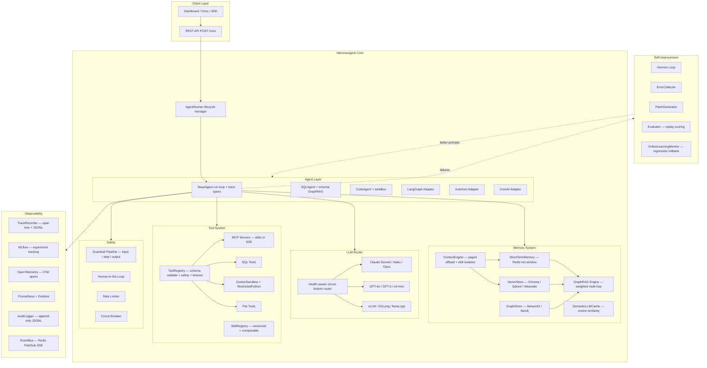

# HarnessAgent

Production-grade agent harness for building, running, observing, and self-improving AI agents. Bring your own framework or use the native SQL and Code agents. Memory, safety, tracing, and failure recovery come included.

[](https://pypi.org/project/agent-haas/)
[](https://python.org)
[](https://fastapi.tiangolo.com)
[](tests/)
[](LICENSE)
[](https://thepradip.github.io/HarnessAgent-docs/)

---

## What is this?

Think about what actually happens when you run an AI agent in production. The LLM call needs to work. It needs to not cost $500 a day. It needs to not loop forever when the API is slow. It needs to remember context from three messages ago — and intelligently *discard* context that no longer matters. It needs to not crash your app when one provider goes down. And when it does fail, it needs to tell you *exactly why*.

HarnessAgent handles all of that.

| What you see | What happens under the hood |
|---|---|
| AI answers your question | Picks the healthiest LLM, checks the budget, falls back if the provider fails |
| AI runs a SQL query | Validates input schema, checks safety rules, executes in a TOOL span, logs the result |
| AI remembers past context | Hot window in Redis → paged cold storage → vector DB; only relevant pages re-injected |
| AI finds relevant info fast | GraphRAG: entity extraction + weighted BFS traversal, 83% fewer tokens than naive vector search |
| AI gets better after failures | Hermes loop: samples errors → LLM patch → eval replay → auto-apply + rollback if regression |
| One provider goes down | Circuit breaker opens after 5 failures, auto-recovers after 60 seconds |
| Run fails | Full span tree (RUN → LLM → TOOL → GUARDRAIL) queryable via `GET /runs/{id}/trace` |
| Long agent session | Older messages auto-compressed + offloaded to vector store; retrieved semantically per query |

---

## Architecture



---

## Features

| Feature | Description |
|---|---|
| **LLM Routing** | Claude, GPT-5, o4-mini, vLLM, SGLang, llama.cpp with health-aware fallback and circuit breaking |
| **Paged Context Engine** | Auto-offload cold messages to vector store; per-skill namespace isolation; action scoring per step |
| **GraphRAG** | 83% token reduction via weighted multi-hop graph traversal vs naive vector search |
| **Semantic LLM Cache** | Cosine-similarity response cache (threshold 0.97) backed by Redis + embeddings |
| **Hierarchical Span Tracing** | Every run produces a `RUN→LLM→TOOL→GUARDRAIL` span tree stored in Redis + JSONL; queryable via API |
| **Framework Adapters** | LangGraph, AutoGen, CrewAI — plug in without rewriting agent logic |
| **Safety Pipeline** | PII redaction, injection detection, tool policy, loop detection, budget enforcement |
| **Hermes Self-Improvement** | Samples failures → LLM generates prompt patch → eval replay → auto-apply + regression rollback |
| **Human-in-the-Loop** | Agent pauses on risky tool calls, waits for approval, then continues or stops |
| **Code Sandbox** | Docker-isolated execution (256 MiB, 1 CPU, no network) with RestrictedPython fallback |
| **Multi-Agent DAG** | Planner decomposes tasks → DAG; Scheduler executes in parallel with back-pressure + handoff enrichment |
| **MCP Support** | Connect any MCP server over stdio or SSE; YAML config; environment variable interpolation |
| **Eval Framework** | Dataset-driven evaluation with per-case diagnostics, failure stage classification, and optimization hints |
| **Audit Trail** | Append-only compliance log (PII-hashed payloads) with Redis stream + JSONL dual persistence |

---

## What's new

### Context Engine (paged context management)

Long-running agents no longer overflow or drop context blindly. The `ContextEngine` manages the hot window per skill namespace and evicts cold pages automatically:

- **Offload** — oldest `~2 000 tokens` are LLM-compressed and evicted to the vector store when the hot window exceeds 80% capacity
- **Select** — before each LLM call, relevant cold pages are retrieved by semantic search against the current query
- **Isolate** — each skill (`sql`, `code`, `search`) has its own Redis key; shared context is merged on demand
- **Evaluate** — every LLM + tool round-trip is scored (`goal_progress`, `tool_relevance`, `confidence`) and stored for Hermes sampling
- **Sub-agents** — parent can slice its context for a child agent within a token budget; child result is injected back as a single compressed message

### Hierarchical span tracing

Every agent run now produces a queryable span tree persisted to Redis (48 h) and `logs/runs/{run_id}/trace.jsonl`:

```
run:sql_agent                        1 234 ms
  llm:call                   450 ms  1 200 tok  $0.002
  guardrail:output             12 ms  passed
  tool:execute_sql            180 ms  42 rows
  llm:call                   310 ms    800 tok  $0.001
```

Query it:
```bash
curl http://localhost:8000/runs/{run_id}/trace
```

### Dashboard — Trace waterfall tab

The operator dashboard (`/`) now includes a **Traces** tab with a full waterfall visualization. Click **Trace** next to any completed run, or paste a run ID. Each row expands to show input/output previews, token counts, cost, and error details.

---

## LLM Support

| Provider | Models | Tool Calling | Prompt Caching | Cost per 1M input tokens |
|---|---|---|---|---|
| Anthropic | Sonnet 4.6, Haiku 4.5, Opus 4.7 | Native | Yes | $0.25 – $15 |
| OpenAI | GPT-4o, GPT-4o-mini, GPT-5, GPT-5-mini, o1, o3, o4-mini | Native | Auto | $0.15 – $75 |
| vLLM | Any HuggingFace model | Native | No | Free (self-hosted) |
| SGLang | Any HuggingFace model | Native | No | Free (self-hosted) |
| llama.cpp | Any GGUF quantized model | ReAct text injection | No | Free (CPU / Metal) |
| Ollama | Any Ollama model | Native | No | Free (local) |

No GPU? llama.cpp runs on any Mac or CPU machine.

---

## Quick Start

```bash
# 1. Clone and install
git clone https://github.com/thepradip/HarnessAgent.git
cd HarnessAgent
poetry install

# 2. Configure (set at least one API key, or a local model URL)
cp .env.example .env

# 3. Start infrastructure (Redis, Qdrant, Neo4j, MLflow, Prometheus, Grafana)
docker compose up -d

# 4. Start API and worker
make api      # terminal 1 — FastAPI on port 8000
make worker   # terminal 2 — async agent worker

# 5. Run your first agent
curl -X POST http://localhost:8000/runs \
  -H "Content-Type: application/json" \
  -d '{"agent_type": "sql", "task": "How many users signed up this week?"}'

# Stream steps in real time
curl http://localhost:8000/runs/{run_id}/stream

# Inspect the full span trace
curl http://localhost:8000/runs/{run_id}/trace
```

No API key? Use llama.cpp locally:

```bash
# Put a GGUF model in ./models/ then:
docker compose --profile local-cpu up -d llamacpp
# Add to .env: LLAMACPP_BASE_URL=http://localhost:8080
```

### Minimal dev setup (no Docker)

```bash
brew install redis && brew services start redis
pip install agent-haas[vector,observe,mcp]
uvicorn harness.api.main:create_app --factory --port 8000
# Open http://localhost:8000/ for the dashboard
```

---

## Python SDK

### Single agent

```python
from harness.core.context import AgentContext
from harness.agents.sql_agent import SQLAgent
from harness.observability.trace_recorder import TraceRecorder
from pathlib import Path

recorder = TraceRecorder.create(redis_url="redis://localhost:6379")

agent = SQLAgent(
    llm_router=llm_router,
    memory_manager=memory,
    tool_registry=registry,
    safety_pipeline=None,
    step_tracer=None,
    mlflow_tracer=mlflow_tracer,
    failure_tracker=failure_tracker,
    audit_logger=audit_logger,
    event_bus=event_bus,
    cost_tracker=cost_tracker,
    checkpoint_manager=checkpoint_manager,
    trace_recorder=recorder,      # ← full span tree
)

ctx = AgentContext.create(
    tenant_id="acme",
    agent_type="sql",
    task="List all tables and their row counts",
    memory=memory,
    workspace_path=Path("/workspaces/acme/run1"),
)

result = await agent.run(ctx)
print(result.output, result.cost_usd, result.steps)

# Query trace after run
trace = await recorder.get_trace(ctx.run_id)
print(trace.total_input_tokens, trace.span_count)
```

### Wrap an existing framework

```python
import harness

adapter = harness.wrap(my_langgraph_graph)
adapter.attach_harness(
    safety_pipeline=pipeline,
    cost_tracker=cost_tracker,
    audit_logger=audit_logger,
)

async for event in adapter.run_with_harness(ctx, {"input": "analyze sales data"}):
    print(event.event_type, event.payload)
```

### Multi-agent DAG

```python
from harness.orchestrator.planner import Planner
from harness.orchestrator.scheduler import Scheduler

planner = Planner(llm_provider=llm)
plan = await planner.plan(
    task="Fetch sales data, analyze trends, write a report",
    available_agents=["sql", "code"],
)

scheduler = Scheduler(agent_runner=runner)
results = await scheduler.execute_plan(plan, tenant_id="acme")
# results: {subtask_id → AgentResult}
```

### Context Engine (paged context)

```python
from harness.memory.context_engine import ContextEngine

engine = ContextEngine.create(
    redis_url="redis://localhost:6379",
    vector_store=vector_store,
    embedder=embedder,
    summarizer=llm,          # LLM compressor; extractive fallback if None
    max_hot_tokens=80_000,
    offload_threshold=0.80,
)

# Push messages with skill namespace
await engine.push(run_id, "user", "list all users", skill_ns="sql", step=1)

# Build context before LLM call — auto-retrieves relevant cold pages
ctx_window = await engine.build_context(run_id, query="list users", skill_ns="sql")

# Score an action after LLM + tool round-trip
action = await engine.evaluate_action(
    run_id, step=1, goal="list users",
    llm_content="I'll run SELECT * FROM users",
    tool_name="execute_sql", tool_result="42 rows",
)
print(action.composite_score)  # 0.0–1.0

# Sub-agent context handoff
slice_ = await engine.slice_for_subagent(
    parent_run_id="parent", child_run_id="child",
    task="summarize the user data", token_budget=8_000,
)
await engine.inject_subagent_result("parent", "child", "Found 42 active users")
```

---

## Use Cases

**SQL Data Agent** — Ask business questions in plain English. The agent reads your schema into a knowledge graph, writes safe SELECT queries, returns formatted results with PII redacted, and shows a full LLM→TOOL span trace.

**Code Assistant** — Give it a ticket or a spec. It reads your workspace, writes the code, lints it, runs it in a Docker sandbox, and fixes errors until it passes.

**Research Agent** — Feed it documents or URLs. It ingests them into the vector store and knowledge graph, then answers multi-hop questions using GraphRAG.

**Multi-Agent Pipeline** — Chain specialists through the planner: researcher feeds coder, coder feeds reviewer. All share the same memory pool and produce a unified trace.

**Long-running Agent** — Sessions that span hundreds of steps use paged context: old turns are compressed and offloaded, only relevant pages are re-injected per query.

**Existing Framework** — Already using LangGraph, AutoGen, or CrewAI? Drop your graph or crew into the adapter. You get traces, cost tracking, circuit breaking, and safety without rewriting agent logic.

---

## Project Structure

```
HarnessAgent/
├── src/harness/
│   ├── agents/            # BaseAgent loop, SQLAgent, CodeAgent
│   ├── adapters/          # LangGraph, AutoGen, CrewAI wrappers
│   ├── api/               # FastAPI routes, JWT auth, SSE streaming
│   │   └── routes/
│   │       ├── runs.py    # POST /runs, GET /runs/{id}/stream
│   │       └── traces.py  # GET /runs/{id}/trace, /spans/{id}
│   ├── core/              # Config, protocols, error hierarchy, circuit breaker
│   ├── eval/              # Datasets, EvalRunner, EvalReport, diagnostics
│   ├── filesystem/        # DockerSandbox, CheckpointManager, workspace
│   ├── improvement/       # HermesLoop, ErrorCollector, Evaluator, OnlineMonitor
│   ├── ingestion/         # PDF/HTML/MD loaders, chunker, extraction
│   ├── llm/               # Anthropic, OpenAI, local providers, router, SemanticCache
│   ├── memory/
│   │   ├── context_engine.py   # Paged offload + skill isolation + action scoring
│   │   ├── manager.py          # Unified memory interface
│   │   ├── graph_rag.py        # Weighted multi-hop retrieval
│   │   ├── short_term.py       # Redis conversation history
│   │   └── backends/           # Chroma, Qdrant, Weaviate
│   ├── messaging/         # Redis Streams inter-agent bus
│   ├── observability/
│   │   ├── trace_schema.py     # TraceSpan, SpanKind, SpanStatus, TraceView
│   │   ├── trace_recorder.py   # Span lifecycle — Redis + JSONL persistence
│   │   ├── tracer.py           # OpenTelemetry integration
│   │   ├── mlflow_tracer.py    # MLflow experiment tracking
│   │   ├── failures.py         # StepFailure, FailureTracker
│   │   ├── metrics.py          # Prometheus counters / histograms / gauges
│   │   ├── audit.py            # Append-only compliance log
│   │   └── event_bus.py        # Redis Pub/Sub for SSE
│   ├── orchestrator/      # AgentRunner, Planner, Scheduler, HITLManager
│   ├── prompts/           # Versioned prompt store, patch application
│   ├── safety/            # Guardrail pipeline factory and per-tenant policies
│   ├── tools/             # ToolRegistry, MCPToolAdapter, SkillRegistry
│   └── workers/           # RQ agent worker, Hermes background scheduler
├── tests/
│   ├── unit/
│   │   ├── test_trace_schema.py       # 27 tests — TraceSpan schema
│   │   ├── test_trace_recorder.py     # 31 tests — span lifecycle, Redis, JSONL
│   │   ├── test_context_engine.py     # 60 tests — offload, scoring, sub-agents
│   │   ├── test_agent_base_fixes.py   # 20 tests — bug fixes + span wiring
│   │   ├── test_api_traces.py         # 14 tests — trace API endpoints
│   │   └── ...                        # 152 tests total
│   └── integration/
├── ui/
│   ├── dashboard.html     # Operator dashboard with Trace waterfall tab
│   └── docs.html          # Full technical reference (open in browser)
├── configs/               # Model capabilities, MCP server definitions
├── infra/                 # Prometheus, OTel collector, Grafana
├── docker-compose.yml     # Redis, Qdrant, Neo4j, MLflow, Grafana
├── Dockerfile
├── Makefile
└── pyproject.toml
```

---

## API Reference

### Runs

| Method | Endpoint | Description |
|---|---|---|
| `POST` | `/runs` | Create and enqueue a run. Body: `{agent_type, task, metadata}` |
| `GET` | `/runs/{run_id}` | Retrieve run record |
| `GET` | `/runs` | List runs for tenant. Query: `limit`, `offset` |
| `DELETE` | `/runs/{run_id}` | Cancel a pending or running run |
| `GET` | `/runs/{run_id}/stream` | SSE stream of StepEvents. Terminates on `completed`/`failed` |

### Traces

| Method | Endpoint | Description |
|---|---|---|
| `GET` | `/runs/{run_id}/trace` | Full span hierarchy with aggregated tokens, cost, duration. 48 h TTL |
| `GET` | `/runs/spans/{span_id}` | Single span by ID |

### Trace response shape

```json
{
  "trace_id":             "ddda858ebe8f42b6...",
  "run_id":               "3f2a8c1e4d...",
  "agent_type":           "sql",
  "status":               "ok",
  "duration_ms":          1234,
  "total_input_tokens":   980,
  "total_output_tokens":  270,
  "total_cost_usd":       0.00031,
  "span_count":           6,
  "spans": [
    {
      "span_id":        "01f04e9413851d7f",
      "parent_span_id": null,
      "kind":           "run",
      "name":           "run:sql",
      "status":         "ok",
      "duration_ms":    1234,
      "input_preview":  "List all tables",
      "output_preview": "Found 7 tables..."
    }
  ]
}
```

---

## Observability

### Span kinds

| Kind | Emitted by | Contains |
|---|---|---|
| `run` | BaseAgent.run() | Full run duration, task, output |
| `llm` | _llm_span() | input/output tokens, model, cost, cached flag |
| `tool` | _execute_one() | tool name, args preview, result preview |
| `guardrail` | safety check | blocked or passed |
| `memory` | memory retrieval | query, tokens used |
| `handoff` | inter-agent message | sender, recipient |
| `eval` | EvalRunner | case id, score |

### Prometheus metrics

| Metric | Labels |
|---|---|
| `harness_agent_steps_total` | agent_type, tenant_id, status |
| `harness_tool_calls_total` | tool_name, agent_type, status |
| `harness_safety_blocks_total` | guard, agent_type, stage |
| `harness_active_runs` | agent_type |
| `harness_cost_usd_total` | tenant_id, model |
| `harness_llm_request_duration_seconds` | provider, model |
| `harness_hermes_patches_total` | agent_type, status |

### Dashboards

| Dashboard | URL | Credentials |
|---|---|---|
| Operator console + Trace waterfall | http://localhost:8000 | API key or dev mode |
| Technical docs | https://thepradip.github.io/HarnessAgent-docs/ | — |
| MLflow Traces | http://localhost:5000 | — |
| Grafana | http://localhost:3000 | admin / harness_admin |
| Prometheus | http://localhost:9090 | — |

---

## Configuration

```bash
# LLM providers
ANTHROPIC_API_KEY=sk-ant-...
OPENAI_API_KEY=sk-...

# Local LLMs (no API key required)
VLLM_BASE_URL=http://localhost:8000
LLAMACPP_BASE_URL=http://localhost:8080

# Memory backends
VECTOR_BACKEND=chroma          # chroma | qdrant | weaviate
GRAPH_BACKEND=networkx         # networkx | neo4j
EMBEDDING_MODEL=all-MiniLM-L6-v2

# Context engine tuning
CONTEXT_MAX_HOT_TOKENS=80000
CONTEXT_OFFLOAD_THRESHOLD=0.80
CONTEXT_COLD_PAGES=3
CONTEXT_RESERVE_OUTPUT=2000

# Hermes self-improvement
HERMES_AUTO_APPLY=false
HERMES_INTERVAL_SECONDS=3600
HERMES_MIN_ERRORS_TO_TRIGGER=5
HERMES_PATCH_SCORE_THRESHOLD=0.7

# Cost and safety
COST_BUDGET_USD_PER_TENANT=100.0
RATE_LIMIT_RPM=60
ENVIRONMENT=dev                # dev | staging | prod
```

---

## Tech Stack

| Layer | Technology | Notes |
|---|---|---|
| API | FastAPI + uvicorn | Async, SSE for step streaming |
| LLM | anthropic + openai SDKs | Both support streaming and native tool calling |
| Tracing | TraceRecorder + Redis + JSONL | Hierarchical spans; 48 h live query; durable JSONL |
| OTel export | opentelemetry-sdk | Optional; exports to Jaeger / Tempo / Grafana Tempo |
| Short-term memory | Redis LIST | Conversation history per run |
| Context engine | Redis + VectorStore | Paged offload, skill namespaces, action scoring |
| Long-term memory | Qdrant / ChromaDB / Weaviate | Chroma for dev, Qdrant/Weaviate for prod |
| Knowledge graph | NetworkX / Neo4j | NetworkX in-process for dev, Neo4j for production |
| LLM cache | Redis + SentenceTransformer | Cosine similarity at 0.97 threshold |
| Experiment tracking | MLflow | LLM-native spans, eval metrics, prompt versioning |
| Metrics | Prometheus + Grafana | 15 pre-defined metrics |
| Safety | Guardrail | 3-stage pipeline: input, step, output |
| Sandbox | Docker + RestrictedPython | 256 MiB, 1 CPU, no network |
| Workers | RQ + Redis | Same Redis, no extra broker |
| Multi-agent | Planner + Scheduler | DAG with Kahn's algorithm, semaphore back-pressure |

---

## Testing

```bash
# Unit tests
PYTHONPATH=src python3 -m pytest tests/unit/

# Integration tests (SQLite, no Docker required)
PYTHONPATH=src python3 -m pytest tests/integration/

# Specific test suites
PYTHONPATH=src python3 -m pytest tests/unit/test_trace_recorder.py
PYTHONPATH=src python3 -m pytest tests/unit/test_context_engine.py

# With coverage
PYTHONPATH=src python3 -m pytest tests/ --cov=src/harness --cov-report=term-missing
```

**Current: 152 unit tests passing, 0 failures.**

| Test file | Tests | What it covers |
|---|---|---|
| `test_trace_schema.py` | 27 | TraceSpan, SpanKind, finish(), to_dict/from_dict, TraceView |
| `test_trace_recorder.py` | 31 | Span lifecycle, parent stack, set_llm_usage, context manager, JSONL |
| `test_context_engine.py` | 60 | Push, build_context, evaluate_action, sub-agent slice, scoring helpers |
| `test_agent_base_fixes.py` | 20 | _record_failure StepFailure fix, _llm_span sync CM fix, span wiring |
| `test_api_traces.py` | 14 | GET /trace, GET /span, TraceView serialisation, route imports |
| Other unit tests | — | BaseAgent lifecycle, tools, context, eval, messaging, MLflow |

---

## Future Scope

| Area | Feature | Expected Impact |
|---|---|---|
| **Tracing** | Export spans to OTel-native backends (Jaeger, Grafana Tempo) with full W3C TraceContext propagation across inter-agent calls | Full distributed trace across parent→child agents |
| **Token Efficiency** | Adaptive context compression — summarize stale history with a small model before appending | 40–60% token reduction on long sessions |
| **Routing** | ML-based predictive model selection — learn per-task-type patterns to auto-select cheapest sufficient model | Eliminates over-provisioned Opus/GPT-5 usage |
| **Context Engine** | Per-skill retrieval tuning — domain-specific embedding models (code vs SQL vs prose) for cold page retrieval | Higher relevance for specialised agents |
| **Parallelism** | Streaming pipeline overlap — start tool execution while LLM still generating | Lower end-to-end step latency |
| **Multi-Agent** | Shared tool execution pool — deduplicate identical tool calls across concurrent agents | Fewer redundant DB and API round-trips |
| **Hermes** | Cost-aware patch targeting — rank prompt candidates by token spend | Better ROI from self-improvement cycles |
| **Scheduling** | Fair-share multi-tenant scheduler — priority queues and resource caps | Predictable per-tenant cost and latency |
| **Safety** | Streaming guardrail evaluation — evaluate rules token-by-token | Interrupt unsafe responses earlier |
| **Extensibility** | Plugin SDK — first-class API for custom LLM providers, memory backends, tool namespaces | Faster integration of new models and datastores |

---

## Contributing

Fork, branch off `main`, write tests for anything new, open a PR.

```bash
git checkout -b feat/your-feature
PYTHONPATH=src python3 -m pytest tests/unit/
ruff check src/ tests/
```

Things that would be useful: new LLM provider adapters, additional vector backends, more tool integrations, Kubernetes Helm chart, and examples for specific use cases.

---

## License

MIT. See [LICENSE](LICENSE).

---

<p align="center">
  <a href="https://thepradip.github.io/HarnessAgent-docs/">Technical Docs</a> &nbsp;|&nbsp;
  <a href="http://localhost:8000">Dashboard</a> &nbsp;|&nbsp;
  <a href="https://github.com/thepradip/HarnessAgent/issues">Issues</a>
</p>
