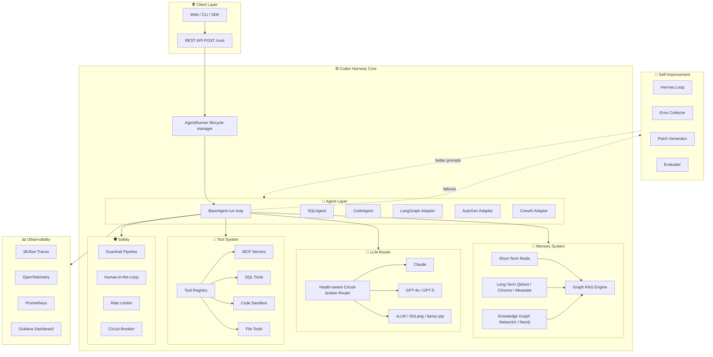

# 🧠 Codex Harness

Run SQL agents, code assistants, or research bots on any LLM. Bring your own framework. Memory, safety, and failure recovery come included.

[](https://python.org)
[](https://fastapi.tiangolo.com)
[](tests/)
[](LICENSE)
[](docs/architecture/OVERVIEW.md)

---

## What is this?

Think about what actually happens when you run an AI agent in production. The LLM call needs to work. It needs to not cost $500 a day. It needs to not loop forever when the API is slow. It needs to remember context from three messages ago. It needs to not crash your app when one provider goes down.

Codex Harness handles all of that. You write the task. It handles the rest.

| What you see | What happens under the hood |
|---|---|
| AI answers your question | Picks the healthiest LLM, checks the budget, falls back if the provider fails |
| AI runs a SQL query | Validates the input schema, checks safety rules, executes, logs the result |
| AI remembers past context | Short-term in Redis, long-term in a vector DB |
| AI finds relevant info fast | Graph RAG: entity extraction plus BFS traversal, 83% fewer tokens than naive vector search |
| AI gets better after failures | Hermes loop: samples errors, proposes a prompt fix, evaluates it, applies if the score clears 70% |
| One provider goes down | Circuit breaker opens after 5 failures, auto-recovers after 60 seconds |

---

## Architecture



---

## Features

| Feature | Description |
|---|---|
| 🔀 **LLM Routing** | Claude, GPT-5, o4-mini, vLLM, SGLang, llama.cpp with automatic health-aware fallback |
| 🧠 **3-Tier Memory** | Redis (hot) then vector DB (warm) then knowledge graph (structured) |
| 📉 **Graph RAG** | 83% token reduction via multi-hop graph traversal vs naive vector search |
| 🔌 **Framework Adapters** | LangGraph, AutoGen, CrewAI plug in without rewriting your agents |
| 🛡️ **Safety Pipeline** | PII redaction, injection detection, tool policy, loop detection, budget enforcement |
| 🔁 **Hermes Loop** | Analyzes failures, proposes prompt patches, evaluates them, applies if the score is good |
| 👤 **Human-in-the-Loop** | Agent pauses on risky actions, waits for approval, then continues or stops |
| ⚡ **Circuit Breaker** | Opens after 5 failures, self-heals after 60 seconds |
| 💰 **Cost Tracking** | Per-run, per-tenant USD cost with hard monthly caps |
| 🔒 **Code Sandbox** | Docker-isolated execution for code agents, 256MB limit, no network |
| 📊 **Observability** | MLflow agent traces, OTel infra spans, Prometheus metrics, Grafana dashboards |
| 🧩 **MCP** | Connect any MCP server over stdio or SSE |

---

## LLM Support

| Provider | Models | Tool Calling | Prompt Caching | Cost per 1M input tokens |
|---|---|---|---|---|
| 🟣 Anthropic | Sonnet 4.6, Haiku 4.5, Opus 4.7 | Native | Yes | $0.25 to $15 |
| 🟢 OpenAI | GPT-4o, GPT-4o-mini, GPT-5, GPT-5-mini, o1, o3, o4-mini | Native | Auto | $0.15 to $75 |
| 🔵 vLLM | Any HuggingFace model | Native | No | Free (self-hosted) |
| 🟡 SGLang | Any HuggingFace model | Native | No | Free (self-hosted) |
| 🔴 llama.cpp | Any GGUF quantized model | ReAct text injection | No | Free (CPU / Metal) |
| 🟠 Ollama | Any Ollama model | Native | No | Free (local) |

No GPU? llama.cpp runs on any Mac or CPU machine. Tool calling works through ReAct text injection when native function calling is not available.

---

## Quick Start

```bash
# 1. Clone and install
git clone https://github.com/thepradip/HarnessAgent.git
cd HarnessAgent
poetry install

# 2. Configure (set at least one API key, or a local model URL)
cp .env.example .env

# 3. Start infrastructure (Redis, Qdrant, Neo4j, MLflow, Prometheus, Grafana)
docker compose up -d

# 4. Start the API and worker
make api      # terminal 1, FastAPI on port 8000
make worker   # terminal 2, async agent worker

# 5. Run your first agent
curl -X POST http://localhost:8000/runs \
  -H "Content-Type: application/json" \
  -d '{"agent_type": "sql", "task": "How many users signed up this week?"}'

# Watch steps in real time
curl http://localhost:8000/runs/{run_id}/steps
```

No API key? Use llama.cpp locally:

```bash
# Put a GGUF model in ./models/ then:
docker compose --profile local-cpu up -d llamacpp
# Add to .env: LLAMACPP_BASE_URL=http://localhost:8080
```

---

## Use Cases

**SQL Data Agent** — Ask business questions in plain English. The agent reads your schema into a knowledge graph, writes safe SELECT queries, and returns formatted results with PII redacted.

**Code Assistant** — Give it a ticket or a spec. It reads your workspace, writes the code, lints it, runs it in a Docker sandbox, and fixes errors until it passes.

**Research Agent** — Feed it documents or URLs. It ingests them into the vector store and knowledge graph, then answers multi-hop questions with citations.

**Multi-Agent Pipeline** — Chain specialists through the planner: a researcher feeds a coder, which feeds a reviewer. All agents share the same memory pool.

**Existing Framework** — Already using LangGraph, AutoGen, or CrewAI? Drop your graph or crew into the adapter. You get traces, cost tracking, circuit breaking, and safety without changing a line of your agent logic.

---

## Project Structure

```
HarnessAgent/
├── src/harness/
│   ├── agents/          # BaseAgent loop, SQLAgent, CodeAgent
│   ├── adapters/        # LangGraph, AutoGen, CrewAI wrappers
│   ├── api/             # FastAPI routes, JWT auth, SSE streaming
│   ├── core/            # Config, circuit breaker, cost tracker, rate limiter
│   ├── eval/            # Datasets, runners, scorers for Hermes evaluation
│   ├── filesystem/      # Isolated workspaces, Docker sandbox, checkpoints
│   ├── improvement/     # Hermes loop, error collector, patch generator
│   ├── ingestion/       # PDF/HTML/MD loaders, chunker, knowledge graph extraction
│   ├── llm/             # Anthropic, OpenAI, local providers, router, factory
│   ├── memory/          # Redis, vector backends, graph, Graph RAG engine
│   ├── messaging/       # Redis Streams inter-agent bus
│   ├── observability/   # MLflow tracer, OTel spans, Prometheus metrics, audit log
│   ├── orchestrator/    # AgentRunner, HITL manager, planner, scheduler
│   ├── prompts/         # Versioned prompt store, patch application
│   ├── safety/          # Guardrail pipeline factory and per-tenant policies
│   ├── tools/           # Tool registry, MCP client, SQL / code / file tools
│   └── workers/         # RQ agent worker, Hermes background scheduler
├── configs/             # Model capabilities, MCP server definitions
├── docs/                # Architecture diagrams and full reference docs
├── infra/               # Prometheus scrape config, OTel collector, Grafana
├── tests/               # 96 unit tests, 2 integration test suites
├── docker-compose.yml   # Full infrastructure: Redis, Qdrant, Neo4j, MLflow, Grafana
├── Dockerfile           # Multi-stage: api, worker, hermes targets
├── Makefile             # install, test, lint, api, worker, hermes, docker-up/down
└── pyproject.toml       # Poetry dependencies and tooling
```

---

## Tech Stack

| Layer | Technology | Notes |
|---|---|---|
| API | FastAPI + uvicorn | Async by default, SSE for step streaming |
| LLM | anthropic + openai SDKs | Both support streaming and native tool calling |
| Short-term memory | Redis | Conversation history, pub/sub, task queue |
| Long-term memory | Qdrant / ChromaDB / Weaviate | Chroma for dev (zero infra), Qdrant for prod |
| Knowledge graph | NetworkX / Neo4j | NetworkX in-process for dev, Neo4j for production |
| Agent tracing | MLflow | LLM-native spans, experiment tracking, eval metrics |
| Infra tracing | OpenTelemetry | Vendor-neutral, exports to Jaeger or Tempo |
| Metrics | Prometheus + Grafana | 15 pre-defined metrics, pre-built dashboard |
| Safety | Guardrail | 3-stage pipeline: input, intermediate, output |
| Workers | RQ + Redis | Same Redis connection, no extra broker needed |
| Deployment | Docker Compose | Scale workers independently with replicas |

---

## Dashboards

Once `docker compose up -d` is running:

| Dashboard | URL | Credentials |
|---|---|---|
| MLflow Traces | http://localhost:5000 | none |
| Grafana | http://localhost:3000 | admin / harness_admin |
| Prometheus | http://localhost:9090 | none |
| Qdrant UI | http://localhost:6333/dashboard | none |
| Neo4j Browser | http://localhost:7474 | neo4j / harnesspassword |

---

## Configuration

Everything goes in `.env`. Copy `.env.example` and set what you need.

```bash
# Cloud LLMs
ANTHROPIC_API_KEY=sk-ant-...
OPENAI_API_KEY=sk-...
OPENAI_MODELS=gpt-4o-mini          # comma-separated, e.g. gpt-4o-mini,gpt-4o

# Local LLMs (no API key needed)
VLLM_BASE_URL=http://localhost:8000
LLAMACPP_BASE_URL=http://localhost:8080

# Memory backends (chroma is default, zero setup)
VECTOR_BACKEND=chroma              # chroma | qdrant | weaviate
GRAPH_BACKEND=networkx             # networkx | neo4j

# Hermes self-improvement
HERMES_AUTO_APPLY=false            # keep this off until you trust it
HERMES_PATCH_SCORE_THRESHOLD=0.7

# Cost and safety
COST_BUDGET_USD_PER_TENANT=100.0
RATE_LIMIT_RPM=60
```

Full reference: [docs/guides/CONFIGURATION.md](docs/guides/CONFIGURATION.md)

---

## Testing

```bash
# Run unit tests
PYTHONPATH=src python3 -m pytest tests/unit/

# Run integration tests (needs SQLite, no Docker required)
PYTHONPATH=src python3 -m pytest tests/integration/

# With coverage
PYTHONPATH=src python3 -m pytest tests/ --cov=src/harness --cov-report=term-missing
```

Current: **96 unit tests passing, 0 failures**.

---

## Documentation

- [Architecture Overview](docs/architecture/OVERVIEW.md) — C4 diagrams, every system flow
- [Quick Start Guide](docs/guides/QUICKSTART.md) — three setup paths: cloud, local, production
- [Configuration Reference](docs/guides/CONFIGURATION.md) — every env var explained
- [Deployment Guide](docs/guides/DEPLOYMENT.md) — Docker Compose to Kubernetes
- [Component Reference](docs/reference/COMPONENTS.md) — all 17 components documented
- [Code Walkthrough](docs/reference/CODE_WALKTHROUGH.md) — follow a request through the actual code
- [Troubleshooting](docs/reference/TROUBLESHOOTING.md) — common issues and fixes
- [HTML Docs](docs/codex-harness-docs.html) — open in browser, click Export PDF for a printable version

---

## Contributing

Fork, branch off `main`, write tests for anything new, open a PR.

```bash
git checkout -b feat/your-feature
PYTHONPATH=src python3 -m pytest tests/unit/
ruff check src/ tests/
```

Things that would be useful: new LLM provider adapters, additional vector backends, more tool integrations, Kubernetes Helm chart, and examples for specific use cases.

---

## License

MIT. See [LICENSE](LICENSE).

---

<p align="center">
  <a href="docs/architecture/OVERVIEW.md">Architecture</a> &nbsp;|&nbsp;
  <a href="docs/guides/QUICKSTART.md">Quick Start</a> &nbsp;|&nbsp;
  <a href="docs/reference/COMPONENTS.md">Components</a> &nbsp;|&nbsp;
  <a href="https://github.com/thepradip/HarnessAgent/issues">Issues</a>
</p>
