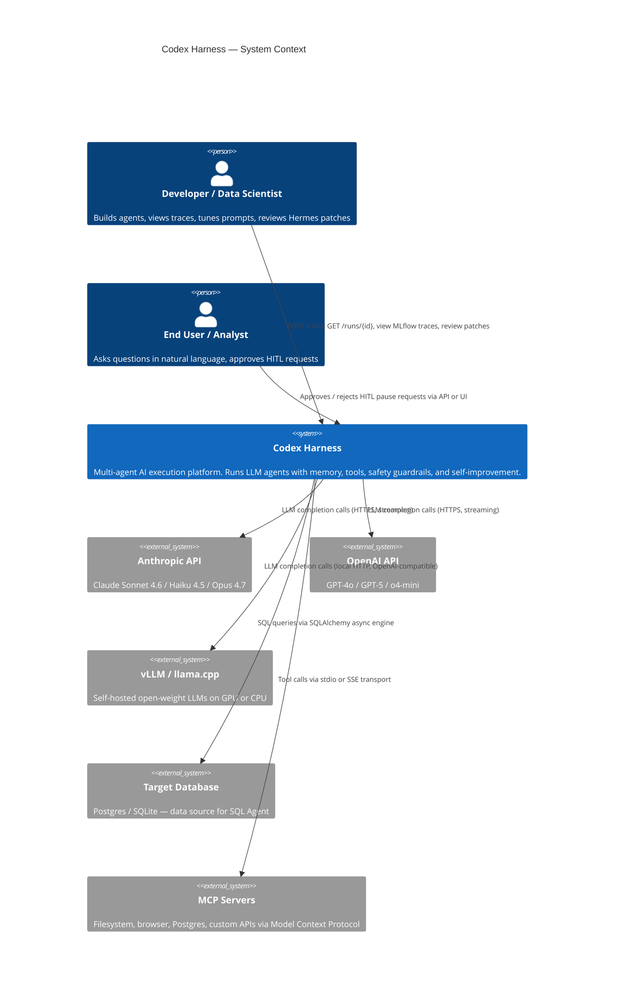
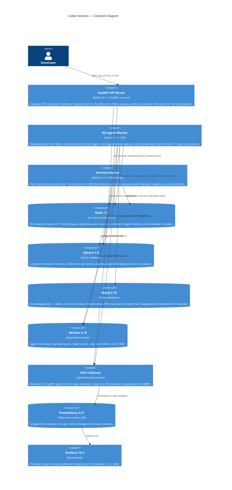
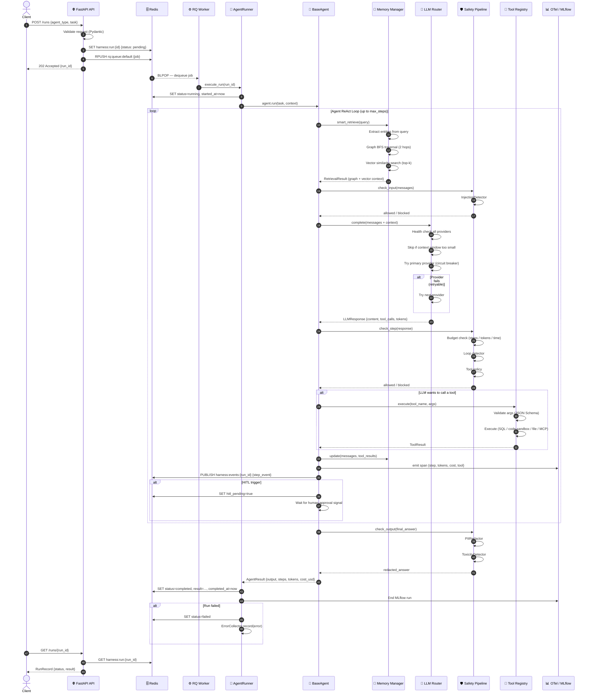
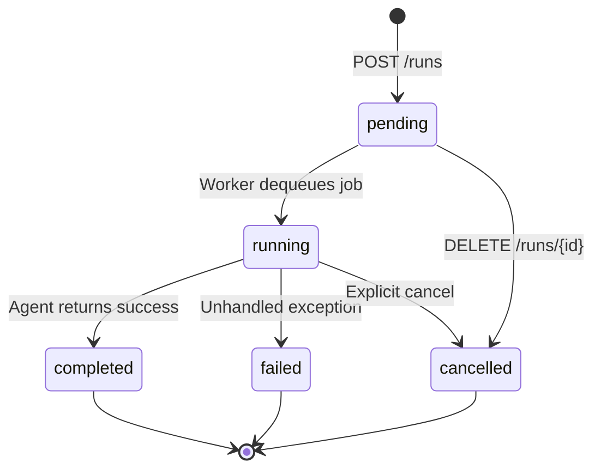
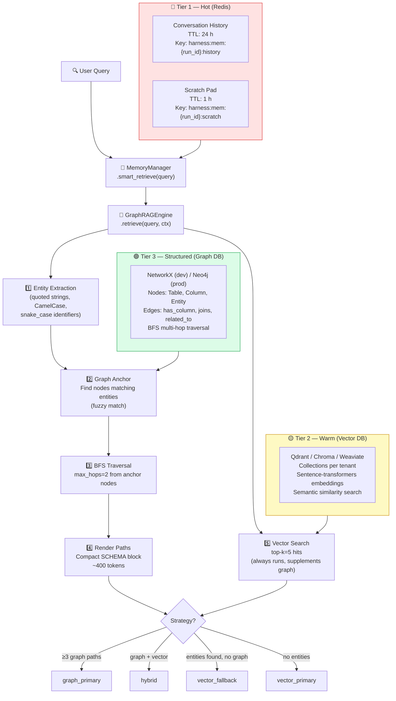
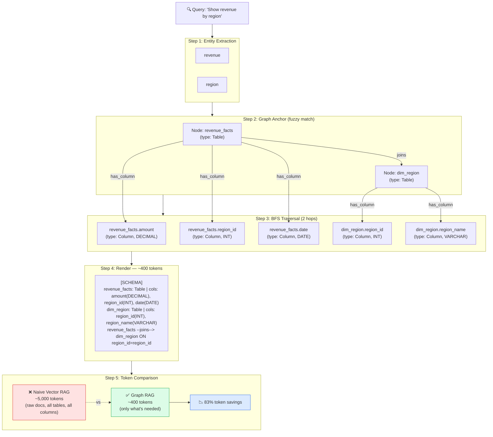
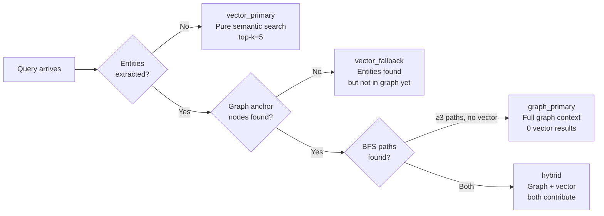
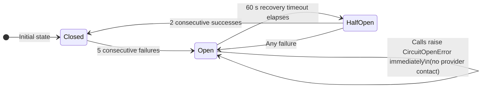
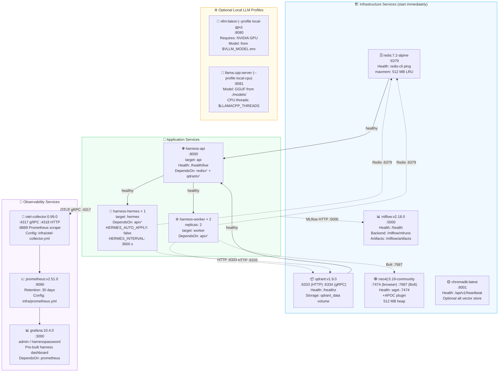

# 🏗️ Codex Harness — Architecture Overview

> **Azure Architecture Center Style | Last Updated: April 2026**
>
> This document is the authoritative deep-dive into how Codex Harness works internally. It is written for two audiences: **non-technical managers** who need to understand what the system does and why it is built this way, and **senior engineers** who need to understand every component well enough to extend, debug, or operate it in production.

---

## Table of Contents

1. [System Context (C4 Level 1)](#1-system-context-c4-level-1)
2. [Container Diagram (C4 Level 2)](#2-container-diagram-c4-level-2)
3. [Agent Execution Flow](#3-agent-execution-flow)
4. [Memory System Architecture](#4-memory-system-architecture)
5. [Graph RAG Deep Dive](#5-graph-rag-deep-dive)
6. [LLM Router Flow](#6-llm-router-flow)
7. [Hermes Self-Improvement Loop](#7-hermes-self-improvement-loop)
8. [Safety Pipeline](#8-safety-pipeline)
9. [Deployment Architecture](#9-deployment-architecture)

---

## 1. System Context (C4 Level 1)

**For managers:** This diagram shows who uses Codex Harness and what external services it connects to. Think of it as a map of the neighborhood — Codex Harness sits in the middle, and all the roads show who talks to it and what it talks to.

**For engineers:** C4 Level 1 context. The harness is a single deployable system boundary. All LLM calls go out over HTTPS to cloud APIs or stay on-prem via local endpoints. The target database (for SQL Agent) and MCP servers are external dependencies.



### Key Decisions at This Level

| Decision | Rationale |
|---|---|
| Multiple LLM providers | No single provider is always best. Claude excels at reasoning; GPT-5 at coding; local models at privacy-sensitive data. |
| MCP for tool connectivity | Standardized protocol means any MCP-compatible server becomes a tool with zero custom code. |
| Target database stays external | The harness never owns the data. It queries it on demand. This keeps data governance simple. |
| HITL via API | Humans approve in whatever UI they already use — a Slack bot, a web dashboard, or a curl call. |

---

## 2. Container Diagram (C4 Level 2)

**For managers:** This diagram shows the main "boxes" that make up the system. Each box is a separate program running independently. They talk to each other through a message queue (Redis). If one box crashes, the others keep running.

**For engineers:** Six application containers sharing a harness-net Docker network. Redis is the single source of truth for run state, task queuing, and pub/sub events. All application containers share the same Docker image built from a multi-stage Dockerfile with named targets (`api`, `worker`, `hermes`).



### Port Map

| Container | Exposed Port | Protocol | Purpose |
|---|---|---|---|
| `harness-api` | 8000 | HTTP | REST API + SSE |
| `harness-redis` | 6379 | TCP | Redis protocol |
| `harness-qdrant` | 6333 / 6334 | HTTP / gRPC | Vector queries |
| `harness-neo4j` | 7474 / 7687 | HTTP / Bolt | Graph browser / Bolt |
| `harness-mlflow` | 5000 | HTTP | MLflow UI |
| `harness-otel-collector` | 4317 / 4318 / 8889 | gRPC / HTTP / scrape | Telemetry ingestion |
| `harness-prometheus` | 9090 | HTTP | Metrics query |
| `harness-grafana` | 3000 | HTTP | Dashboard UI |
| `harness-chromadb` | 8001 | HTTP | Alt vector store |
| `harness-vllm` (GPU profile) | 8080 | HTTP | OpenAI-compat API |
| `harness-llamacpp` (CPU profile) | 8081 | HTTP | OpenAI-compat API |

---

## 3. Agent Execution Flow

**For managers:** This diagram shows the journey of a single request — from the moment a user asks a question, to the moment they get an answer. Think of it like a relay race: the baton (the task) is passed from one runner to the next until the finish line (the answer).

**For engineers:** The execution path spans two processes (API and Worker) with Redis as the handoff. The agent run loop is synchronous within the worker coroutine. Each step writes an OTel span and publishes an event to the Redis pub/sub channel `harness:events:{run_id}` for SSE streaming.



### State Machine

A `RunRecord` moves through these states:



---

## 4. Memory System Architecture

**For managers:** Imagine your AI assistant has three kinds of memory — just like a person does:
- **Short-term memory** (what they're working on right now) — kept in Redis, fast, temporary.
- **Long-term memory** (things they've learned before) — kept in a vector database, searchable by meaning.
- **Structured knowledge** (a mental map of how things relate to each other) — kept in a graph database, great for "how does A relate to B?"

When you ask a question, the harness checks all three and picks the most relevant pieces before it even calls the AI.

**For engineers:** `MemoryManager` is the unified facade. `GraphRAGEngine` decides the retrieval strategy (graph-primary, hybrid, vector-fallback, vector-primary) based on entity anchor hit count.



### Memory Write Path

After each agent step, memory is updated in all tiers:

| Event | Tier 1 (Redis) | Tier 2 (Vector) | Tier 3 (Graph) |
|---|---|---|---|
| New user message | Append to history | — | — |
| Tool result (SQL) | Append to scratch | Embed result → upsert | Add table/column nodes if new |
| Tool result (file) | Append to scratch | Embed content → upsert | Add entity nodes |
| Agent final answer | — | Embed answer → upsert | — |
| Session end (TTL) | Auto-expires 24 h | Persists forever | Persists forever |

---

## 5. Graph RAG Deep Dive

**For managers:** Instead of throwing every piece of potentially relevant information at the AI (which is expensive and slow), Graph RAG is like a librarian who knows exactly which shelves to check. It uses a "map" of how all your data relates, and only retrieves the pieces that are actually connected to your question — using 83% fewer words than the old approach.

**For engineers:** `GraphRAGEngine` implements entity extraction via three regex strategies (quoted literals, CamelCase, snake_case identifiers minus a stop-word set), fuzzy node anchoring, BFS traversal with configurable depth, and compact path rendering. Token savings come from the `_render_paths()` method which deduplicates and formats graph paths into a structured `[SCHEMA]` block rather than dumping raw document chunks.

### Worked Example: "Show revenue by region"



### Retrieval Strategy Decision Tree



---

## 6. LLM Router Flow

**For managers:** The LLM Router is like an air traffic controller for AI models. When you need an AI response, it checks which models are healthy, whether any have been blocked due to recent failures, and routes your request to the best available option. If that one fails, it automatically tries the next — all in milliseconds.

**For engineers:** `LLMRouter` maintains a `CircuitBreaker` per `(provider_name, model)` key using `CircuitBreakerRegistry`. The breaker uses a half-open state after `recovery_timeout=60s` with `success_threshold=2` calls required to fully close. Only errors with `failure_class in {LLM_RATE_LIMIT, LLM_TIMEOUT, LLM_ERROR}` trigger fallback; non-retryable errors (e.g., auth failures) propagate immediately.

```mermaid
flowchart TD
    START["📨 LLMRouter.complete(messages)"]
    SORT["Sort providers by priority"]

    START --> SORT --> LOOP

    subgraph LOOP["For each provider (sorted by priority)"]
        CTX{Context window\ncheck}
        CTX -->|"required_context > window"| SKIP1["⏭️ Skip — context too large"]
        CTX -->|OK| HC{Health check}
        HC -->|Unhealthy| SKIP2["⏭️ Skip — health check failed"]
        HC -->|Healthy| CB{Circuit\nBreaker?}
        CB -->|Open| SKIP3["⏭️ Skip — circuit open\nlast_exc = CircuitOpenError"]
        CB -->|Closed / Half-Open| TRY["🔮 provider.complete(messages)"]
        TRY -->|Success| RETURN["✅ Return LLMResponse"]
        TRY -->|Retryable error\n(rate limit / timeout / LLM_ERROR)| SKIP4["⏭️ Try next provider\nCircuitBreaker records failure"]
        TRY -->|Non-retryable error\n(auth / validation)| RAISE["❌ Raise immediately"]
    end

    SKIP1 & SKIP2 & SKIP3 & SKIP4 --> NEXT{More\nproviders?}
    NEXT -->|Yes| LOOP
    NEXT -->|No| EXHAUST["❌ Raise LLMError:\n'All providers exhausted'"]

    style RETURN fill:#dcfce7,stroke:#16a34a
    style EXHAUST fill:#fee2e2,stroke:#dc2626
    style RAISE fill:#fee2e2,stroke:#dc2626
```

### Circuit Breaker State Machine



### Provider Priority Configuration

Providers are registered with an integer priority (lower = preferred). A typical production configuration:

| Priority | Provider | Model | Context Window |
|---|---|---|---|
| 0 | Anthropic | claude-sonnet-4-6 | 200,000 |
| 1 | OpenAI | gpt-4o | 128,000 |
| 2 | OpenAI | gpt-4o-mini | 128,000 |
| 3 | vLLM | mistral-7b-instruct | 32,768 |
| 4 | llama.cpp | mistral-7b-Q4_K_M | 4,096 |

---

## 7. Hermes Self-Improvement Loop

**For managers:** Hermes is the system that makes the AI get smarter over time — automatically. It watches for patterns in AI mistakes, asks the AI to suggest improvements to its own instructions, tests those improvements, and if they pass a quality threshold, applies them. It is like a manager who reads all the customer complaint forms, proposes a new training script, and rolls it out if it passes a pilot test.

**For engineers:** `HermesLoop` is driven by `APScheduler` (with asyncio fallback) at a configurable interval (default 3600 s). It runs concurrently across all agent types via `asyncio.gather`. The patch threshold is configurable (`hermes_patch_score_threshold=0.7`). Patches that pass evaluation but have `auto_apply=False` land in the `approved` state and wait for a human to apply via `POST /improvement/apply/{patch_id}`.

```mermaid
flowchart TD
    SCHED["⏰ APScheduler\nEvery hermes_interval_seconds (default: 3600 s)"]

    SCHED --> GATHER["asyncio.gather — run all agent types concurrently\n['sql', 'code', 'base']"]

    subgraph CYCLE["HermesLoop.run_cycle(agent_type)"]
        COUNT["1️⃣ ErrorCollector.count(agent_type)\nin rolling window"]
        COUNT --> THRESHOLD{errors ≥\nmin_errors\n(default: 5)?}
        THRESHOLD -->|No| SKIP["⏭️ Skip cycle\n(not enough signal yet)"]
        THRESHOLD -->|Yes| SAMPLE["2️⃣ ErrorCollector.get_recent()\nSample up to 2× min_errors records"]
        SAMPLE --> PROMPT["3️⃣ Load current system prompt\nfrom PromptStore"]
        PROMPT --> GENERATE["4️⃣ PatchGenerator.generate()\nLLM analyzes errors + current prompt\nReturns: Patch {op, path, value, rationale}"]
        GENERATE --> PATCH_CHECK{Patch\ngenerated?}
        PATCH_CHECK -->|No| NO_PATCH["PatchOutcome(applied=False)\n'No proposal returned'"]
        PATCH_CHECK -->|Yes| EVAL["5️⃣ Evaluator.score(patch, test_cases)\nReplays failing tasks with patched prompt\nScores 0.0 – 1.0"]
        EVAL --> SCORE{score ≥ threshold\nAND auto_apply?}
        SCORE -->|"Yes (auto_apply=True)"| APPLY["✅ _apply_patch()\nPromptStore.update_prompt()\nstatus = 'applied'"]
        SCORE -->|"Score ≥ threshold\nauto_apply=False"| APPROVE["📋 Store patch\nstatus = 'approved'\nAwaits human via API"]
        SCORE -->|"Score < threshold"| REJECT["❌ Store patch\nstatus = 'rejected'"]
        EVAL_FAIL["⚠️ Evaluation error\nstatus = 'pending'"] --> STORE2["Store for manual review"]
        APPLY & APPROVE & REJECT & STORE2 --> METRIC["6️⃣ hermes_patches_total.labels(\nagent_type, status).inc()"]
        METRIC --> OUTCOME["PatchOutcome {patch, eval_result, applied, reason}"]
    end

    GATHER --> CYCLE

    style APPLY fill:#dcfce7,stroke:#16a34a
    style REJECT fill:#fee2e2,stroke:#dc2626
    style APPROVE fill:#fef9c3,stroke:#ca8a04
    style SKIP fill:#f3f4f6,stroke:#9ca3af
```

### Patch Object Structure

A `Patch` produced by `PatchGenerator` has the following shape:

```json
{
  "patch_id": "a3f8c2d1...",
  "agent_type": "sql",
  "op": "append",
  "path": "system_prompt",
  "value": "When the user asks about time-based aggregations, always include a GROUP BY on the date truncation column.",
  "rationale": "14 of 20 sampled errors involved missing GROUP BY on truncated dates.",
  "score": 0.82,
  "status": "applied",
  "created_at": "2026-04-22T10:30:00Z"
}
```

Supported `op` values: `append`, `prepend`, `replace`, `remove`, `set`.

---

## 8. Safety Pipeline

**For managers:** The Safety Pipeline is the bouncer, the inspector, and the editor — all in one. Before the AI even starts working, it checks your input for signs of manipulation. While it's working, it makes sure it's not going in circles or spending too much. When it's done, it removes any sensitive personal information before sending you the answer.

**For engineers:** `build_pipeline()` in `safety/pipeline_factory.py` assembles a `guardrail.Pipeline` with three named `Stage` objects. The pipeline is agent-type-aware: SQL agents get a strict `allowed_tools` allowlist; code agents get sandbox-scoped tools; research agents get read-only tools. The `_NullPipeline` fallback ensures the harness degrades gracefully if the `guardrail` package is not installed.

```mermaid
flowchart LR
    INPUT["📨 Incoming Request\n(user message + history)"]

    subgraph S1["🔴 Stage 1 — Input Guards"]
        INJ["InjectionDetector\nDetects prompt injection attempts\n(jailbreaks, system override phrases)"]
        LEN["LengthLimiter\nRejects inputs exceeding\nmax_tokens threshold"]
    end

    subgraph S2["🟡 Stage 2 — Intermediate Guards\n(checked every agent step)"]
        BUDGET["Budget Guard\n• max_steps: 50\n• max_tokens: 100,000\n• max_wall_seconds: 300"]
        LOOP["LoopDetector\nWindow = 10 steps\nDetects repeated identical tool calls"]
        TOOL["ToolPolicy\nAllowlist / blocklist per agent type\n(SQL agent cannot call run_python)"]
        DESTRUCT["DestructiveCommandFilter\nBlocks DROP, DELETE, TRUNCATE\nunless allow_destructive=True"]
    end

    subgraph S3["🟢 Stage 3 — Output Guards"]
        PII["PIIRedactor\nRedacts: emails, phone numbers,\nSSNs, credit cards, names"]
        TOX["ToxicityDetector\nFlags harmful output\nfor audit log"]
        GROUND["GroundingChecker\nVerifies claims are supported\nby retrieved context"]
    end

    BLOCKED["❌ Request Blocked\n(403 + reason in response)"]
    PASSED["✅ Output Delivered\n(redacted, grounded)"]

    INPUT --> S1
    S1 -->|Blocked| BLOCKED
    S1 -->|Passed| AGENT["🤖 Agent Execution Loop"]
    AGENT --> S2
    S2 -->|Blocked| BLOCKED
    S2 -->|Passed| AGENT
    AGENT -->|Final answer| S3
    S3 --> PASSED

    style S1 fill:#fee2e2,stroke:#dc2626
    style S2 fill:#fef9c3,stroke:#ca8a04
    style S3 fill:#dcfce7,stroke:#16a34a
    style BLOCKED fill:#fee2e2,stroke:#dc2626
    style PASSED fill:#dcfce7,stroke:#16a34a
```



### Default Safety Profiles by Agent Type

| Guard | SQL Agent | Code Agent | Research Agent | Base Agent |
|---|---|---|---|---|
| InjectionDetector | ✅ | ✅ | ✅ | ✅ |
| Budget (steps) | 50 | 50 | 50 | 50 |
| Budget (tokens) | 100,000 | 100,000 | 100,000 | 100,000 |
| LoopDetector | ✅ | ✅ | ❌ | ✅ |
| ToolPolicy (allowlist) | execute_sql, list_tables, describe_table, sample_rows | run_python, lint_code, read_file, write_file, apply_patch, list_workspace | read_file, write_file, list_workspace | All tools |
| DestructiveCommandFilter | ✅ strict | ✅ strict | — | — |
| PIIRedactor | ✅ | ✅ | ✅ | ✅ |

---

## 9. Deployment Architecture

**For managers:** This diagram shows the full set of services that run when you start Codex Harness. Each box represents a running program. The arrows show which programs must start before others (dependencies). The ports show where you can access each service in your browser or via API calls.

**For engineers:** Docker Compose orchestrates all services on the `harness-net` bridge network (subnet `172.20.0.0/16`). Health checks gate startup order: `worker` and `hermes` wait for `api` (healthy), which waits for `redis` and `qdrant` (healthy). The `api` and `worker` containers share the same image (multi-stage Dockerfile). `worker` runs with `deploy.replicas: 2` for parallel job processing.



### Volume Map

| Volume | Used By | Contents |
|---|---|---|
| `redis_data` | Redis | AOF / RDB persistence (disabled by default for performance) |
| `qdrant_data` | Qdrant | Vector collections, segment files |
| `neo4j_data` | Neo4j | Graph store, transaction logs |
| `chromadb_data` | ChromaDB | SQLite-backed vector store |
| `mlflow_data` | MLflow | Experiment runs, artifact files |
| `prometheus_data` | Prometheus | Time-series blocks (30-day retention) |
| `grafana_data` | Grafana | Dashboard state, user preferences |
| `workspaces` | API + Workers | Per-run file sandboxes at `/workspaces/{tenant}/{run_id}/` |

### Starting Optional LLM Profiles

```bash
# GPU-accelerated vLLM (requires NVIDIA Docker runtime)
VLLM_MODEL=mistralai/Mistral-7B-Instruct-v0.2 \
  docker compose --profile local-gpu up -d

# CPU-only llama.cpp (put your GGUF in ./models/)
LLAMACPP_MODEL=mistral-7b-instruct-v0.2.Q4_K_M.gguf \
  docker compose --profile local-cpu up -d
```

---

## Appendix: Key Configuration Variables

| Variable | Default | Description |
|---|---|---|
| `ANTHROPIC_API_KEY` | — | Anthropic API key. Required if using Claude. |
| `OPENAI_API_KEY` | — | OpenAI API key. Required if using GPT models. |
| `VECTOR_BACKEND` | `qdrant` | Vector store: `qdrant`, `chroma`, or `weaviate` |
| `GRAPH_BACKEND` | `neo4j` | Graph store: `neo4j` or `networkx` |
| `HERMES_AUTO_APPLY` | `false` | Auto-apply patches that pass evaluation threshold |
| `HERMES_INTERVAL_SECONDS` | `3600` | How often the Hermes loop runs |
| `HERMES_MIN_ERRORS_TO_TRIGGER` | `5` | Minimum error count to trigger a Hermes cycle |
| `HERMES_PATCH_SCORE_THRESHOLD` | `0.7` | Minimum eval score for patch to be applied |
| `JWT_SECRET_KEY` | `change-me` | Secret key for JWT auth. Must be set in production. |
| `ENVIRONMENT` | `dev` | `dev` or `prod`. Controls log level and debug behavior. |
| `WORKSPACE_BASE_PATH` | `/workspaces` | Base directory for per-run file sandboxes |

---

*For the quick-start guide, return to the [project README](../../README.md). For API endpoint documentation, see [docs/reference/](../reference/).*
