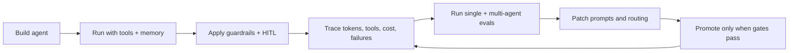

# HarnessAgent Business Pitch

## Positioning

HarnessAgent is the operating layer for enterprise AI agents. It helps teams move from agent demos to governed, measurable, cost-controlled agent operations.

The product is not another chatbot builder. It is the harness around agents: evaluation, guardrails, tools, memory, routing, observability, cost controls, and human approvals.

## Customer Pain

AI agent adoption is blocked by trust, cost, and operational risk:

- Leaders cannot tell which agents are reliable enough to deploy.
- Engineers spend time rebuilding safety, tracing, memory, and tool plumbing.
- Finance teams cannot attribute token spend by agent, task, or tenant.
- Risk teams cannot prove guardrails are working.
- Prompt improvements ship without regression tests.
- Multi-agent systems fail silently when handoffs lose context.

HarnessAgent gives each stakeholder a clear control surface.

## Buyer And User Map

| Stakeholder | What they need | HarnessAgent answer |
|---|---|---|
| CTO / Head of AI | Production readiness and governance | One control plane for agents, tools, evals, and policies. |
| VP Engineering | Faster platform delivery | Shared runtime for routing, memory, tools, observability, and safety. |
| Data / Analytics Lead | Safe SQL and workflow agents | Read-only tools, schema checks, PII redaction, eval gates. |
| Risk / Compliance | Proof of controls | Guardrail hits, HITL queues, audit logs, blocked actions. |
| Finance / FinOps | Cost control | Token, cost, cache, and per-agent spend attribution. |
| Product Ops | Continuous improvement | Hermes prompt patching and prompt comparison gates. |

## Product Narrative

HarnessAgent turns agent operations into a measurable lifecycle:

## Differentiation

| Alternative | Gap | HarnessAgent advantage |
|---|---|---|
| Raw LLM API | No agent lifecycle, evals, tool governance, or cost controls | Full agent runtime and release gates. |
| Framework-only stacks | Good for building flows, weak on operations | Wraps agents with safety, telemetry, evals, and budgets. |
| Dashboard-only monitoring | Observes after the fact | Connects observation to evals, prompt patches, and routing. |
| Custom internal platform | Slow and expensive to build | Ready control-plane primitives with extension points. |

## Business Outcomes

| Outcome | Mechanism |
|---|---|
| Faster deployment | Shared runtime avoids rebuilding safety, tools, memory, and telemetry for every team. |
| Lower AI spend | Router policies, cache metrics, token hotspots, and cost gates. |
| Fewer incidents | Guardrails, HITL, tool contracts, and release evals catch failures before production. |
| Better agent quality | Prompt comparison and failure-stage diagnostics turn defects into targeted fixes. |
| More executive trust | Dashboard shows pass rate, cost, tools, guards, handoffs, cache, and risk posture. |

## Go-To-Market Wedge

Start with engineering and data teams deploying high-value internal agents:

1. SQL analytics agent for business questions.
2. Code review and repository improvement agent.
3. Multi-agent workflow harness for research, analysis, remediation, and approval.

The wedge is practical: teams already have agent prototypes. HarnessAgent makes them operable.

## Pricing Logic

The pricing model should align with operational value:

- Platform fee for the control plane.
- Usage tier based on monthly runs or evaluated tasks.
- Enterprise add-ons for compliance exports, SSO/RBAC, private model routing, and custom guardrail packs.

The strongest ROI story is avoided platform rebuild time plus reduced model spend and incident risk.

## Pilot Plan

| Week | Milestone | Evidence |
|---|---|---|
| 1 | Connect one SQL or code agent | First governed run with trace and cost. |
| 2 | Add tool contracts and guardrails | Tool errors and blocked action reporting. |
| 3 | Build smoke and regression eval suite | Pass rate, failure-stage, and token baseline. |
| 4 | Deploy dashboard to pilot operators | Run, eval, cost, guardrail, and HITL visibility. |
| 5 | Optimize prompt/router/cache | Measured cost reduction or pass-rate lift. |
| 6 | Executive readout | Go/no-go decision with metrics and roadmap. |

## Investment Ask

Invest in HarnessAgent as the internal or commercial operating layer for AI agents. The next tranche should fund:

- Productization of eval history and CI/CD gates.
- Enterprise access controls and audit exports.
- Framework adapter factories for broader agent adoption.
- FinOps dashboards for model routing and spend optimization.

## Closing

The agent market will not be won by the team with the most demos. It will be won by the team that can operate agents safely, cheaply, and continuously. HarnessAgent is built for that operating reality.
