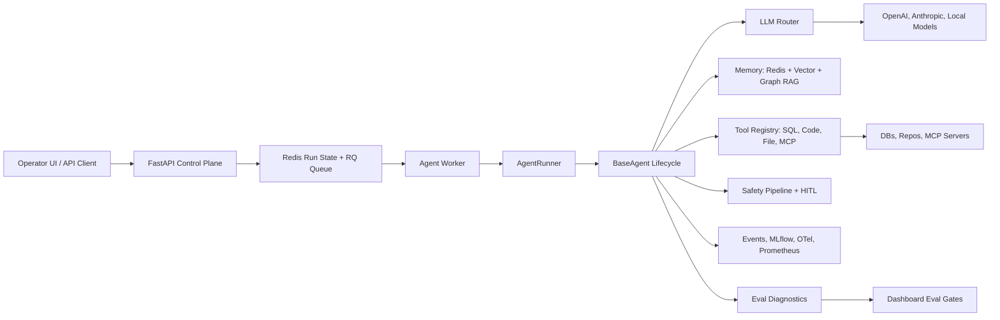
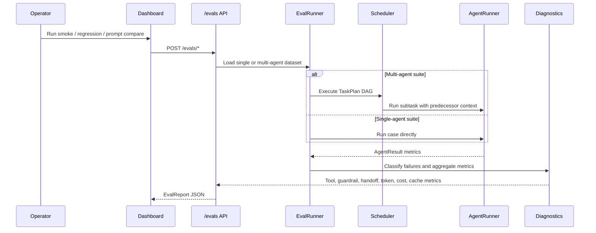

# HarnessAgent Technical Pitch

## Executive Summary

HarnessAgent is a production control plane for AI agents. It turns single-agent and multi-agent prototypes into governed systems with routing, memory, tools, guardrails, human approvals, observability, cost tracking, and evaluation gates.

The latest implementation adds a production-grade evaluation layer: single-agent smoke suites, multi-agent handoff suites, prompt comparison, tool/guardrail diagnostics, token and cost attribution, cache visibility, and UI-triggered eval runs.

## Technical Problem

Teams can build impressive agent demos quickly, but production agent systems fail in predictable ways:

- The wrong model handles a task and cost grows without quality gains.
- Agents loop, exceed budget, or lose context.
- Tool calls fail because schemas, permissions, or timeouts are not tested.
- Multi-agent handoffs lose critical context between subtasks.
- Guardrails exist, but teams cannot see where they block, pass, or need HITL.
- Prompt fixes ship without regression evidence.

HarnessAgent is built around the idea that an agent system needs a harness before it needs more agents.

## Architecture

## Core Components

| Component | Role |
|---|---|
| FastAPI API | Creates runs, streams events, serves the operator console, exposes eval endpoints. |
| AgentRunner | Persists run lifecycle and executes BaseAgent-compatible agents. |
| Scheduler | Runs multi-agent TaskPlans with dependency-aware handoffs and bounded concurrency. |
| BaseAgent | Runs the ReAct loop, calls the router, executes tools, tracks budget, emits events. |
| LLM Router | Routes across providers by health, context window, and fallback priority. |
| Tool Registry | Validates schemas, applies safety checks, runs tools, emits tool telemetry. |
| Safety Pipeline | Applies injection, PII, output, tool, budget, and HITL policies. |
| Eval Runner | Runs single-agent and multi-agent suites and classifies failure stages. |
| Dashboard | Operator console for runs, eval gates, models, keys, guardrails, approvals, and review gaps. |

## Evaluation Pipeline

The evaluation layer treats quality, reliability, and cost as one release gate.

## What The Latest Harness Measures

| Metric | Why it matters |
|---|---|
| Pass rate | Release gate for baseline quality. |
| Failure stage | Separates tool, safety, budget, LLM, memory, router, planner, communication, and quality failures. |
| Tool calls and errors | Shows whether failures are caused by schema, timeout, missing tool, or unsafe tool execution. |
| Guardrail hits | Shows where policy blocks or routes to HITL. |
| Handoff count | Makes multi-agent communication measurable instead of invisible. |
| Token and cost totals | Identifies which agent consumes the budget. |
| Cache hits and cached tokens | Shows where repeated context can be reused. |
| Optimization hints | Converts eval metrics into prompt, router, tool, guardrail, cache, and retrieval actions. |

## Multi-Agent Guardrails And Tool Communication

The multi-agent path now preserves these signals:

- Scheduler passes predecessor outputs into dependent subtasks.
- Subtasks receive `handoff_count` metadata.
- AgentResult carries tool calls, tool errors, guardrail hits, cache hits, and handoff counts.
- Eval diagnostics aggregate metrics at both plan level and sub-agent level.
- The dashboard renders tools, guards, handoffs, cache, pass rate, token user, and average cost from live `/evals` responses.

## Production Readiness

The system is designed for production controls:

- Queue-backed execution with Redis and RQ.
- Explicit runnable-agent contract between UI, API, and worker.
- Guardrail enforcement before model/tool/output boundaries.
- HITL support for risky tool calls.
- Per-run streaming events.
- Prompt improvement loop through Hermes.
- DOM-tested dashboard behavior and graceful degraded state when Redis is unavailable.

## Roadmap

| Phase | Focus | Outcome |
|---|---|---|
| 1 | Native SQL/code agent hardening | Reliable first production agents. |
| 2 | Adapter factories for LangGraph, CrewAI, AutoGen | Bring external frameworks under the same governance layer. |
| 3 | Persistent eval datasets and run history | Longitudinal release gates and trend analysis. |
| 4 | Router policy UI | Cost/quality routing rules managed by operators. |
| 5 | Enterprise controls | RBAC, audit exports, data residency, and policy templates. |

## Technical Ask

Fund and staff the next build phase around three workstreams:

1. Eval persistence and CI gates for every agent change.
2. Adapter factory completion for framework-based agents.
3. Operator-grade policy controls for routing, guardrails, budgets, and HITL.
